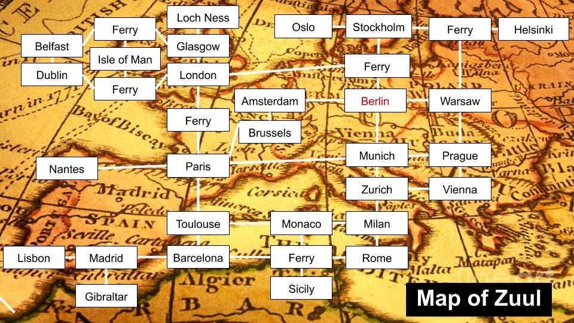

# Game Documentation

### Theme
The game takes place in an age where western Europe has been plagued by a strange disease. The hero has to travel across Europe to find ingredients that can be made into a cure.

### How to win/lose
If the time runs out (40 moves) the plague has spread too quickly and there is no stopping it.

If the hero manages to collect 7 (or more) out of 10 ingredients and makes it to one of the three medical research facilities scattered around western Europe before it's too late, the world is saved.

### Extensions
**6.47** &nbsp; Characters that give you hints were added in Stocholm, Dublin, Belfast, London, Paris, Lisbon, Amsterdam, Zurich and Prague.

**6.41** &nbsp; A time limit in the form of limiting the number of moves was added to the game.
